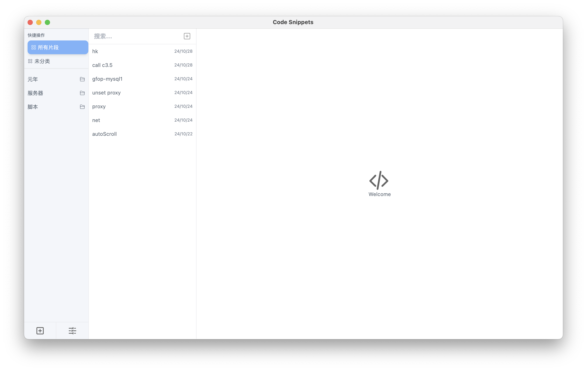
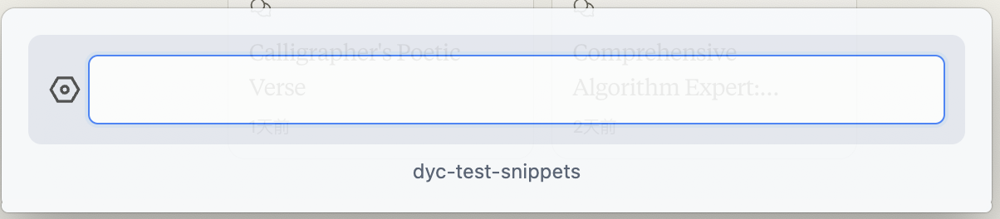

# Code Snippets Manager

<div align="center">


一个现代化的跨平台代码片段管理工具，帮助开发者高效管理和复用代码片段。

</div>

## ✨ 主要特性

- 🗂 智能分类: 通过标签系统灵活组织代码片段
- 🔍 快速搜索: 支持实时搜索，快速定位所需片段
- ✏️ 便捷编辑: 支持双击修改标签名称
- 🖱 拖拽操作: 通过拖拽轻松调整片段分类
- 📝 代码高亮: 支持多种编程语言的语法高亮
- ⚡️ 快捷键支持: 自定义快捷键提升操作效率
- 💾 本地存储: 使用SQLite数据库，确保数据安全

## 🖥 应用界面

<div align="center">




</div>

## 🚀 快速开始

### 环境要求

- Node.js 16.0.0 或更高版本
- npm 7.0.0 或更高版本

### 安装步骤

1. 克隆仓库

```bash
git clone https://github.com/dyc54/code-snippets-manager.git
```

2. 进入项目目录

```bash
cd code-snippets-manager
```

3. 安装依赖

```bash
npm install
```

4. 启动应用

```bash
# 开发模式
npm run dev

# 构建应用
npm run build

# 运行构建后的应用
npm run start
```

## 📖 使用指南

### 基本操作

1. **添加片段**

   - 点击左下角 "+" 按钮
   - 选择代码片段所属标签
   - 输入代码内容并保存

2. **管理标签**

   - 双击标签名称进行修改
   - 拖拽片段到不同标签进行分类
   - 右键点击标签进行更多操作

3. **搜索片段**
   - 使用顶部搜索栏
   - 支持按标签、内容搜索
   - 实时展示搜索结果

### 快捷键

| 功能     | Windows/Linux | MacOS  |
| -------- | ------------- | ------ |
| 新建片段 | Ctrl + N      | ⌘ + N  |
| 保存片段 | Ctrl + S      | ⌘ + S  |
| 搜索片段 | Ctrl + F      | ⌘ + F  |
| 删除片段 | Delete        | Delete |

## ⚙️ 配置说明

配置文件位于 `~/.config/snippet-manager/config.json`（可在设置页面修改）：

- 待实现

```json
{
  "database": {
    "path": ".config/snippet/snippet.db"
  },
  "shortcuts": {
    "newSnippet": "CommandOrControl+N",
    "saveSnippet": "CommandOrControl+S"
  }
}
```

## 🛠 技术栈

- **前端框架**: React 18
- **桌面框架**: Electron 24
- **状态管理**: Zustand
- **数据存储**: SQLite
- **构建工具**: Vite
- **编程语言**: JavaScript/TypeScript

## 🤝 贡献指南

1. Fork 项目
2. 创建特性分支 (`git checkout -b feature/AmazingFeature`)
3. 提交修改 (`git commit -m 'Add some AmazingFeature'`)
4. 推送到分支 (`git push origin feature/AmazingFeature`)
5. 提交 Pull Request

## 📋 后续规划

- [ ] 支持代码片段加密存储
- [ ] 添加云同步功能
- [ ] 支持更多编程语言的语法高亮
- [ ] 优化搜索算法
- [ ] 添加代码片段分享功能

## 📝 开源协议

本项目基于 MIT 协议开源，详见 [LICENSE](LICENSE) 文件。

## 🙏 致谢

- [Electron](https://www.electronjs.org/)
- [React](https://reactjs.org/)
- [Zustand](https://github.com/pmndrs/zustand)
- [SQLite](https://www.sqlite.org/)
